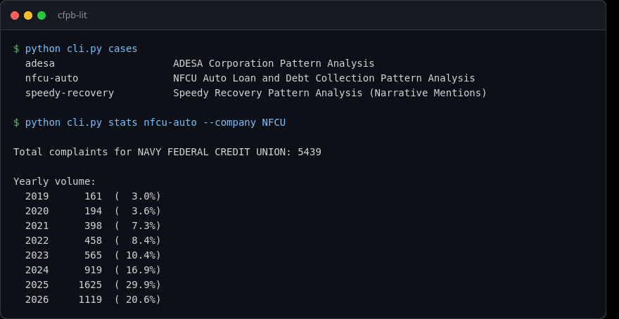
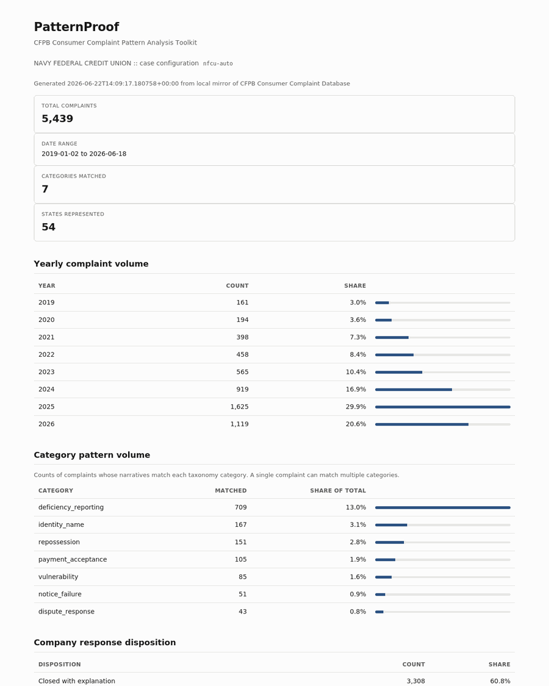

# PatternProof

**CFPB Consumer Complaint Pattern Analysis Toolkit**

_Designed by PinkViper Labs. & Jade Riley Burch_

PatternProof pulls complaints from the CFPB's public Consumer Complaint search API into a local SQLite database, runs a configurable keyword and regex taxonomy across the narratives, and produces litigation-ready outputs: summary CSVs, tagged complaint lists, anonymized narrative excerpts, citation ID lists, and a standalone HTML pattern report.

Open-ended by design. Each case is a YAML file under `config/cases/` defining the filter criteria (company, product, date range, state) and the classification taxonomy (categories of interest with their keywords). New cases are new YAML.

## Why use this?

Use public CFPB complaint data to:

- Identify recurring patterns in how a company handles a product or dispute
- Support or pressure-test a litigation theory with documented complaint volume
- Quantify patterns over time ("X percent of this company's complaints in this category over this period describe this conduct")
- Generate a clean, shareable HTML report and CSVs from raw complaint data
- Build evidentiary summaries and citation lists tied to specific complaint IDs

It runs entirely on your own machine against a public, no-auth API, so your research stays local.

## Screenshots

The CLI, including company-alias resolution (here `NFCU` resolves to the canonical name):



The generated HTML pattern report:



## Install

```
git clone https://github.com/YOUR_USERNAME/patternproof.git
cd patternproof
python -m venv .venv
source .venv/bin/activate
pip install -r requirements.txt
```

On Windows, activate with `.venv\Scripts\activate` instead.

Requires Python 3.10 or newer. The repository ships without a database; you build your own with `init` and `pull` as shown below.

## Quick start (NFCU case)

```
python cli.py init
python cli.py pull nfcu-auto
python cli.py classify nfcu-auto
python cli.py stats nfcu-auto --company "NAVY FEDERAL CREDIT UNION"
python cli.py report nfcu-auto --company "NAVY FEDERAL CREDIT UNION"
python cli.py export nfcu-auto --company "NAVY FEDERAL CREDIT UNION"
python cli.py excerpts nfcu-auto repossession --company "NAVY FEDERAL CREDIT UNION" --limit 25
```

Outputs land under `exports/<case_id>/`.

## Bundled example cases

Three case configurations ship in `config/cases/` as working examples you can run or copy:

- `nfcu-auto` filters to one company across two products and classifies repossession, payment-acceptance, notice-failure, and related patterns.
- `adesa` filters to a single company and classifies title, condition-disclosure, and fee patterns.
- `speedy-recovery` shows the free-text approach: it uses `search_term` to pull every complaint whose narrative mentions an entity that is not itself a CFPB-supervised company, then classifies repossession-conduct and breach-of-peace patterns.

Run `python cli.py cases` to list them.

## Commands

| Command | What it does |
|---|---|
| `init` | Create or upgrade the SQLite schema |
| `cases` | List available case configurations |
| `pull <case_id>` | Fetch matching complaints from the CFPB API |
| `classify <case_id>` | Run the case taxonomy across pulled narratives |
| `stats <case_id> --company NAME` | Print summary statistics to the terminal |
| `overlap <case_id> cat_a cat_b ... --company NAME` | Count complaints matching ALL listed categories |
| `export <case_id> --company NAME` | Write summary CSV and tagged complaint list |
| `excerpts <case_id> <category> --company NAME` | Write narrative excerpts and citation IDs |
| `report <case_id> --company NAME` | Generate a standalone HTML report |
| `renormalize` | Recompute canonical company names after editing aliases |
| `status` | Show row counts, recent pull log, and cases on record |

All commands accept `--db PATH` and `--cases-dir PATH` before the subcommand to override defaults.

## Defining a new case

Copy `config/cases/_template.yaml` to `config/cases/<your_case_id>.yaml` and edit.

Filters narrow what gets pulled from the API. The taxonomy defines the categories you want to count.

Each taxonomy category supports:

- `description`: plain-language label
- `keywords`: phrases matched case-insensitively as whole words
- `regex`: raw regex patterns (case-insensitive)
- `min_matches`: how many pattern hits required for the complaint to count (default 1)

A single complaint can match multiple categories. Overlaps are queryable via the `overlap` command and via direct SQL on the `classifications` table.

## Company name normalization

Companies report themselves to the CFPB under inconsistent names, and people type them inconsistently too. `config/aliases.yaml` collapses known variants into one canonical name so a single company is not split across several spellings:

```
NAVY FEDERAL CREDIT UNION:
  - NFCU
  - NAVY FED
  - NAVY FEDERAL
```

Matching is case-insensitive and is applied in two places: at pull time when `company_normalized` is computed, and at query time when you pass `--company`. That means `stats nfcu-auto --company NFCU` and `stats nfcu-auto --company "Navy Federal"` both resolve to the same canonical company.

If you edit the alias file after pulling, run `python cli.py renormalize` to recompute existing rows without re-pulling. The file is optional; with it absent the tool falls back to light suffix and case handling only.

## Incremental pulls

`pull` is idempotent: it INSERTs OR REPLACEs on `complaint_id`. To do a date-bounded incremental refresh, pass `--since YYYY-MM-DD`. For testing, `--max-pages N` caps the work.

The CFPB search API is public and requires no API key or authentication. The tool paginates with a short delay between pages to stay polite. Large pulls simply take longer; there is no token to configure.

## Database

Plain SQLite. Schema lives in `patternproof/db.py`. Tables:

- `complaints`: one row per CFPB complaint, with `raw_json` preserving the full original payload
- `complaints_fts`: FTS5 virtual table over the narratives, ready for full-text search
- `classifications`: per-complaint, per-case, per-category match results with the matched terms recorded
- `pull_log`: history of every pull with filter JSON, counts, and notes
- `cases`: registered case configurations with their full JSON config

The database file is yours: back it up, query it from anywhere with any SQLite client, or attach it as a secondary database to integrate it into a larger case-management system.

## Evidentiary framing

The CFPB database contains consumer-reported complaints transmitted to the company for response. Narratives appear with explicit consumer consent and are public record. The data is suitable as evidence of complaint pattern and corporate notice ("X percent of [company]'s CFPB complaints in [category] over [period] involve [pattern]"), not as factual proof of misconduct in any underlying case. Complaint volume reflects only consumers who knew how to escalate, so any pattern figure is an undercount.

The `company_public_response` field is also captured. When a company's standard public response is "company believes it acted appropriately as authorized by contract" against complaints describing UCC violations, that is itself evidence of a corporate position on the practices alleged.

## Data source

CFPB Consumer Complaint Database, public search API:
`https://www.consumerfinance.gov/data-research/consumer-complaints/search/api/v1/`

API documentation: https://cfpb.github.io/ccdb5-api/

The database is published by the U.S. Consumer Financial Protection Bureau and is in the public domain.

## Example output

`examples/sample-report.html` is a generated pattern report you can open in any browser to see the format before running your own pull.

## Development

Run the test suite with:

```
pip install -r requirements-dev.txt
pytest
```

The tests cover the classification engine, the database schema and upsert behavior, and the query-building and normalization logic. None of them touch the network.

## License

Released under the MIT License. See `LICENSE`. The underlying CFPB complaint data is public domain, published by the U.S. Consumer Financial Protection Bureau.

## Disclaimer

This tool surfaces patterns in public complaint data. It is not legal advice, and complaint volume is not proof of misconduct in any individual case. See the Evidentiary framing section for how to characterize the output responsibly.
